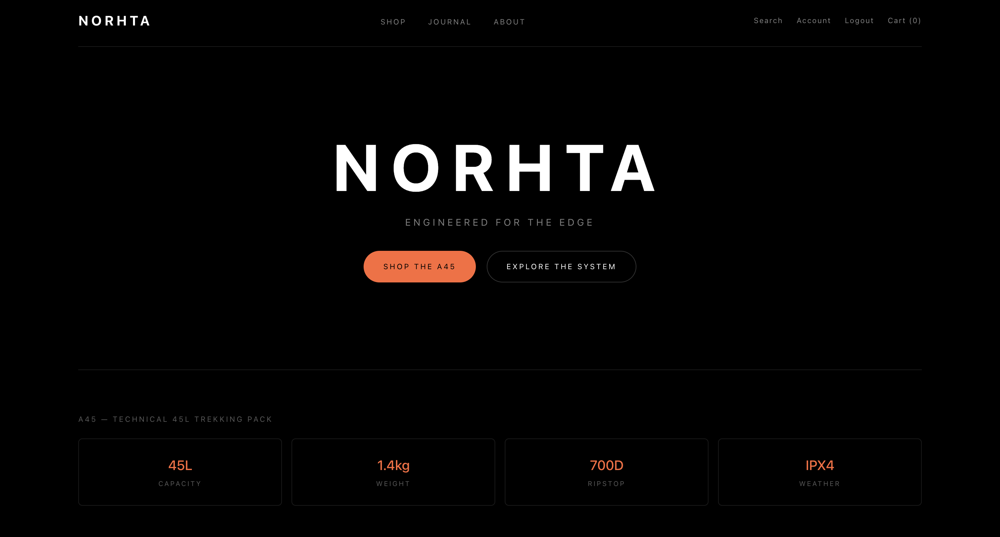
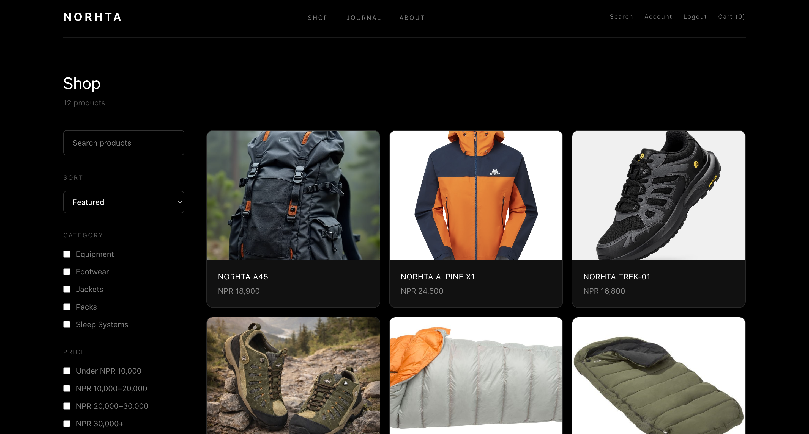
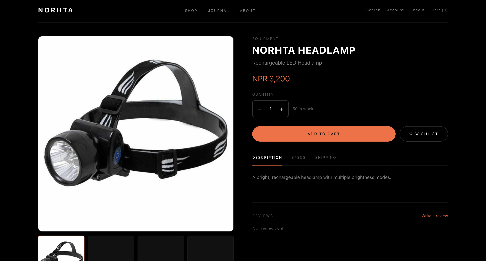
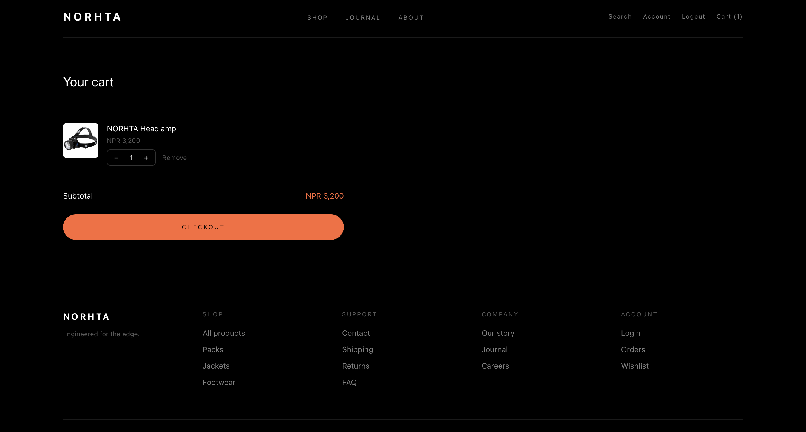
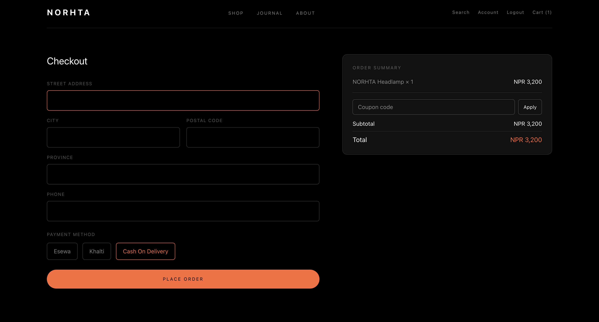
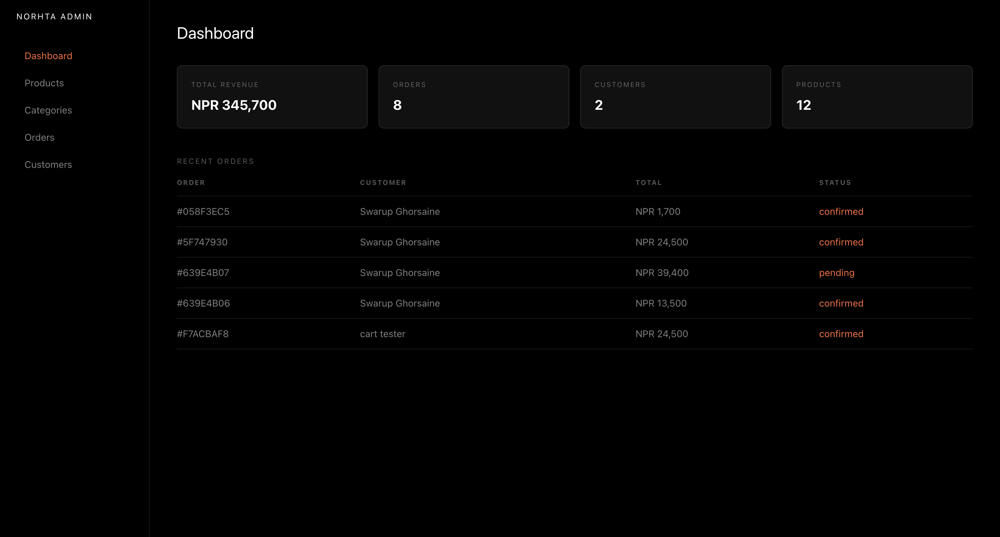
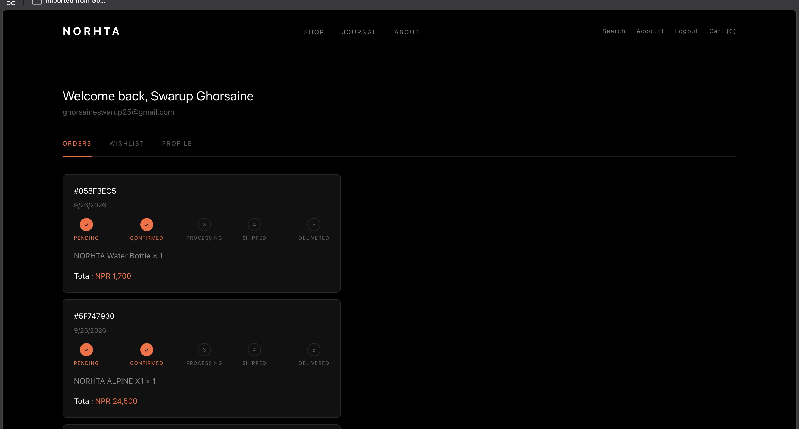

# NORHTA

**Engineered for the edge.**

A full-stack e-commerce platform for a fictional premium outdoor and trekking equipment brand — Project 3 of a 3-project full-stack portfolio (Restaurant → Hotel → E-commerce).

> Born in Kathmandu. Tested in the Himalayas.



## Live demo

**Frontend:** [norhta.vercel.app](https://norhta.vercel.app)
**Backend API:** [norhta-backend.onrender.com/api/health](https://norhta-backend.onrender.com/api/health)

> Note: the backend runs on Render's free tier, which spins down after ~15 minutes of inactivity. The first request after idle time may take 20–30 seconds to wake up — subsequent requests are fast.

## Screenshots

| Shop | Product detail |
|---|---|
|  |  |

| Cart | Checkout |
|---|---|
|  |  |

| Admin dashboard | Order tracking |
|---|---|
|  |  |

## Features

- **Product catalog** — server-side search, category filtering, price range, sorting
- **Product detail pages** — image gallery, variant selection (color/size), stock-aware quantity picker, specs/description/shipping tabs
- **Auth** — JWT in httpOnly cookies, bcrypt hashing, rate-limited login
- **Cart** — server-backed, live price/stock revalidation on every change
- **Checkout** — shipping form, coupon codes, eSewa/Khalti/COD payment methods, atomic stock deduction
- **Order tracking** — visual status timeline (Pending → Confirmed → Processing → Shipped → Delivered)
- **Reviews** — verified-purchase checking, aggregate ratings
- **Wishlist**
- **Admin dashboard** — full CRUD for products/categories/orders, customer list, role-protected
- **Newsletter signup**
- **Security** — Helmet, CORS with credentials, mongo-sanitize, rate limiting, CSRF protection (cross-domain-safe token flow) on all mutating routes

## Tech stack

**Frontend**: Next.js (App Router), React, TypeScript, Tailwind CSS — deployed on Vercel
**Backend**: Node.js, Express, MongoDB Atlas, Mongoose, JWT, Zod — deployed on Render
**Security**: helmet, cors, express-rate-limit, express-mongo-sanitize, CSRF double-submit token pattern

## Project structure
norhta/
├── frontend/
│ └── src/{app,components,lib}
├── backend/
│ └── {routes,models,middleware,utils}
├── docs/images/
└── README.md


## Getting started

### Prerequisites

- Node.js 18+
- A MongoDB Atlas cluster

### Setup

1. Clone the repo
```bash
   git clone https://github.com/ghorsaineswarup/norhta.git
   cd norhta
```

2. Install dependencies
```bash
   cd backend && npm install
   cd ../frontend && npm install
```

3. Configure environment variables

   `backend/.env`

PORT=5001
MONGODB_URI=your_mongodb_atlas_connection_string
JWT_SECRET=your_jwt_secret
NODE_ENV=development

   `frontend/.env.local`

   NEXT_PUBLIC_API_URL=http://localhost:5001/api


4. Seed the database (optional)
```bash
   cd backend && node seed.js
```

5. Run locally
```bash
   # Terminal 1
   cd backend && npm run dev

   # Terminal 2
   cd frontend && npm run dev
```

6. Open [http://localhost:3000](http://localhost:3000)

## Deployment

- **Frontend** deployed on Vercel, root directory `frontend/`, with `NEXT_PUBLIC_API_URL` pointing at the live backend.
- **Backend** deployed on Render as a Node web service, root directory `backend/`, with `MONGODB_URI`, `JWT_SECRET`, `NODE_ENV=production`, and `FRONTEND_URL` (for CORS) set as environment variables.
- Since frontend and backend live on different domains in production, CSRF tokens are fetched via a dedicated `/api/auth/csrf-token` endpoint rather than read directly from a cookie by frontend JavaScript — this keeps the double-submit CSRF pattern working across domains, where direct cross-domain cookie reads aren't reliable.

## Notable implementation details

- **Never-trust-the-client pricing**: cart and checkout totals are always recalculated server-side from current product price/stock.
- **Atomic stock deduction**: order placement uses atomic MongoDB operations to prevent overselling under concurrent orders.
- **Cross-domain CSRF protection**: the CSRF token is fetched via an authenticated JSON endpoint and cached client-side, rather than relying on direct `document.cookie` reads — necessary because the frontend and backend are deployed on separate domains (Vercel and Render), where a JS-readable cookie set by one domain isn't visible to script running on the other.

## Roadmap

- Real payment gateway integration for eSewa/Khalti (currently sandboxed)
- Email confirmations for orders and newsletter signups
- Admin-side product image upload

## Author

**Swarup Ghorsaine**
[GitHub](https://github.com/ghorsaineswarup)

---

Part of a 3-project full-stack portfolio: Himalayan Kitchen → Stonepine Lodge → **Norhta (this project)**